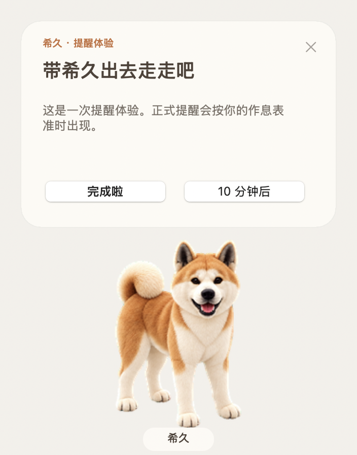
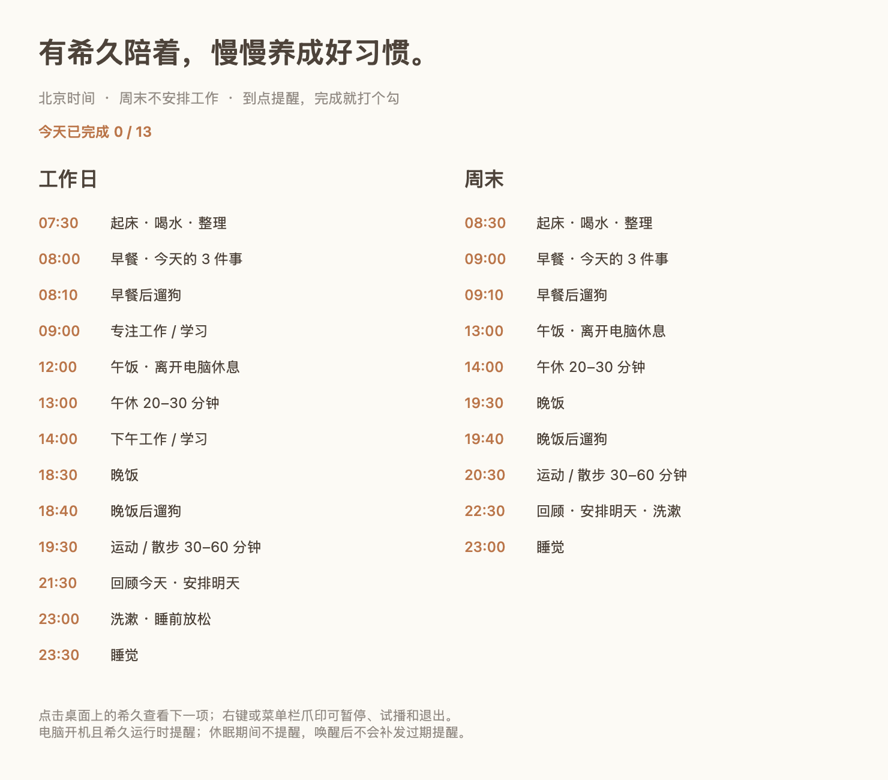

# 希久提醒 · Xijiu Reminder

一只陪你规律生活的 Mac 桌宠。以小狗「希久」的照片为原型，棕白毛色、立耳、卷尾，到了时间就用气泡提醒你吃饭、遛狗、运动和休息。



## 功能

- 透明悬浮桌宠，可拖动并记住位置，带动作动画和 16 个注视方向。
- 按北京时间提醒，区分工作日与周末；周末不安排工作、起床晚一小时、23:00 睡觉。
- 早餐、晚饭提醒后 10 分钟遛狗；支持完成打卡、延后 10 分钟和暂停。
- 菜单栏爪印可查看作息、试播提醒、调整提示音及退出。
- 使用 Swift 与 AppKit，本机运行，无需联网、账号或额外运行库。

## 使用

适用于 **Apple 芯片 Mac，macOS 13 或更新版本**。

下载发布版本中的 `xijiu-reminder-v1.0.0-macos-arm64.zip`，解压后将「希久提醒.app」放入「应用程序」并打开；也可以按下面步骤从源码构建。

应用使用本地临时签名，尚未经过 Apple 公证。从网络下载后，macOS 可能要求你在「系统设置 → 隐私与安全性」中确认打开。

**提醒需要电脑保持唤醒，且应用正在运行。** 应用不会自动设置登录启动；退出、关机或睡眠期间不提醒，唤醒后会跳过超过 90 秒的过期事项。

完整操作与时间表见 [使用说明](使用说明.md)。



## 从源码构建

需要 Apple 芯片 Mac 和 Xcode Command Line Tools。首次使用可运行 `xcode-select --install` 安装构建工具。

在项目目录中运行：

```sh
./build.sh
open "希久提醒.app"
```

构建脚本会生成并临时签名「希久提醒.app」。修改 `Resources/schedule.json` 后重新构建即可调整时间、文字及对应动作。`weekdays` 表示周一至周五，`weekends` 表示周六、周日，不自动跟随法定节假日调休。

## 验证

```sh
xcrun swiftc -swift-version 5 Sources/Schedule.swift Tests/main.swift -o /tmp/xijiu-schedule-tests
/tmp/xijiu-schedule-tests Resources/schedule.json
codesign --verify --deep --strict "希久提醒.app"
```

时间表测试覆盖工作日与周末、北京时间、餐后遛狗、跨日、过期事项和重复提醒过滤。应用内部的气泡展示、完成、延后操作及界面渲染已检查；实际鼠标拖动与窗口层级仍需人工试用。

## 项目文件

| 路径 | 用途 |
| --- | --- |
| `Sources/` | 桌宠界面与提醒逻辑 |
| `Resources/schedule.json` | 可修改的北京时间作息表 |
| `Resources/spritesheet.png` | 8 列 × 11 行动画图集 |
| `Resources/AppIcon.icns` | 应用图标 |
| `Tests/` | 时间表行为测试 |
| `codex-pet/` | 独立的 Codex v2 桌宠素材 |
| `build.sh` | 本地构建与临时签名 |

`codex-pet/` 中的 `pet.json` 与 `spritesheet.webp` 可一起放入 `~/.codex/pets/xijiu/`，供支持 v2 桌宠的 Codex 使用；该素材包本身不运行生活提醒，提醒由 Mac 应用负责。

希久形象由 ImageGen 根据小狗照片生成；仓库包含生成的动画素材，不包含原始照片。详见 [制作记录](制作记录.md)。
